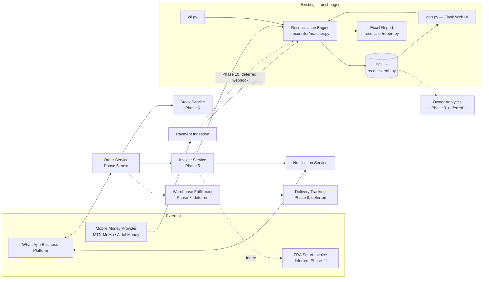
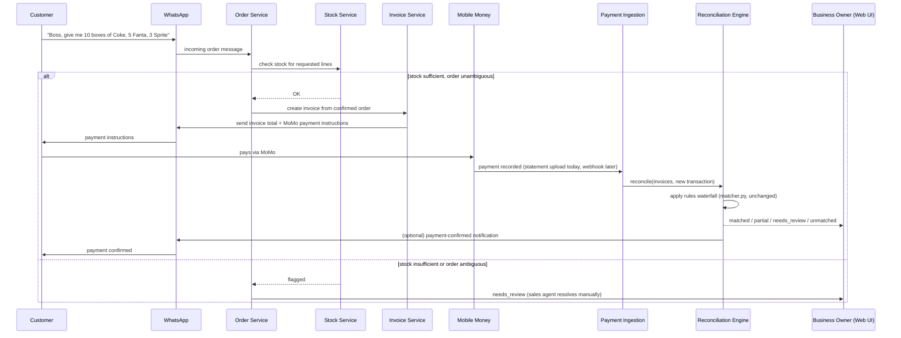

# Architecture — WhatsApp Order-to-Cash for FMCG Distributors

See [REQUIREMENTS.md](REQUIREMENTS.md) for scope and [DATA_MODEL.md](DATA_MODEL.md)
for entities. This document covers component architecture, the external
systems we're drawing patterns from, and the tech-stack decisions.

## 1. Architectural principles

1. **Deterministic first, human-in-the-loop for anything ambiguous
   involving money or stock.** Already the governing rule in
   `reconciler/matcher.py` (never auto-confirm a match on amount alone when
   two customers could owe the same amount). Every new module — order
   parsing, stock checks — extends the same rule: uncertain → flagged for
   a human, never guessed.
2. **Every automated decision is traceable to a named rule.** Mirrors
   `match_rule` in the existing schema. An order that got auto-confirmed,
   or one that got flagged, should always be answerable with "because of
   rule X," never "the model felt like it."
3. **Prove the manual/upload version before building the live-integration
   version.** This is exactly the pattern that already happened once in
   this codebase: CLI (manual, upload-based) shipped and got a test suite
   *before* the web UI wrapped it, and the web UI still shares the same
   `reconciler.*` core rather than reimplementing anything. The same
   discipline applies going forward: structured WhatsApp ordering before
   free-text NLP, statement-upload reconciliation before live MoMo
   webhooks, single-warehouse stock before multi-warehouse allocation.
4. **Model data to be standards-aware before compliance is mandatory.**
   Cheaper to shape the `Invoice` entity correctly once than to migrate it
   under regulatory pressure later (see the PEPPOL/EN16931 reference
   below).

## 2. Reference systems

These are patterns to borrow, not products to clone — named specifically
so decisions can be checked against a real precedent instead of
first-principles guessing.

### Wasoko (formerly Sokowatch) — Kenya/Tanzania/Uganda/Rwanda, B2B FMCG distribution to informal retailers
**Pattern borrowed:** order aggregation from many small, repeat B2B
customers into one system, a warehouse-fulfillment-then-delivery pipeline,
and (later, once order history accumulates) embedded credit scored off
that history. This directly informs the shape of Phases 7–9 in the
roadmap.
**Where the pattern *doesn't* transfer:** Wasoko operates its own
warehouses and fleet — it *is* the distributor. We're building software
*for* a distributor who already owns the warehouse and the customer
relationship. Our "warehouse" module is fulfillment tracking for someone
else's warehouse, not logistics operations of our own. Worth restating
whenever a Wasoko-inspired feature is being scoped, so we don't
accidentally design for the wrong side of that relationship.

### Twiga Foods — Kenya, B2B fresh-produce supply chain
**Pattern borrowed:** the core validated behavior — small businesses will
place *repeat* B2B orders through a digital channel once it's reliably
faster than the manual alternative, without needing the underlying
relationship (supplier trust, credit terms) to change. Reinforces the
positioning choice in [REQUIREMENTS.md](REQUIREMENTS.md#2-product-statement):
the sales agent stays in the loop, the system removes the eleven
disconnected steps around them, it doesn't replace the relationship.

### Safaricom Daraja API (M-Pesa) — Kenya, mobile money integration
**Pattern borrowed:** Daraja draws a clean line between two integration
shapes:
- **Batch/statement reconciliation** — pull a statement after the fact,
  match it against records. This is what `reconciler/matcher.py` does
  today, and it's deliberately where this project started (per the
  existing README's own "statement upload first, API integration only
  once you know it's worth building").
- **Live callback reconciliation** — the provider pushes a payment
  confirmation to a registered webhook the instant it happens (Daraja's
  STK Push + C2B confirmation callback; MTN/Airtel MoMo's equivalents in
  Zambia follow the same shape).

The concrete implication: when live MoMo integration is eventually built
(Phase 10, deferred — see [ROADMAP.md](ROADMAP.md)), it should be a new
*transport* that calls the same `reconcile()` function on a single
incoming transaction that the CLI/web UI already call on a batch — **not**
a parallel reconciliation implementation. That's why `matcher.reconcile()`
takes plain DataFrames rather than anything upload-shaped: a webhook
handler can construct a one-row DataFrame from a callback payload and
call the exact same function.

### PEPPOL / EN16931 — EU e-invoicing standard
**Pattern borrowed:** not the PEPPOL network itself (that's EU-specific
infrastructure) but its underlying discipline — an invoice is a
structured document with a fixed minimum field set (unique sequential
number, issue date, seller/buyer tax identifiers, line-level tax
breakdown, currency) designed to be machine-verifiable by a third party,
not just human-readable. Zambia's own ZRA Smart Invoice program, and
Kenya's KRA eTIMS, are functionally the same idea. **Practical
implication:** [DATA_MODEL.md](DATA_MODEL.md)'s `Invoice` entity carries
those fields now, unused, so a future fiscalization integration
(Phase 11) is additive, not a schema migration.

## 3. Component architecture

The box labeled "Existing — unchanged" is the whole point of this
diagram: everything built so far (the matching waterfall, persistence,
Excel reporting, CLI, web UI, and their 58-test suite) is the
**reconciliation stage** of this pipeline, and nothing above changes it —
new modules produce invoices and consume the reconciliation engine's
output, they don't reimplement matching logic.

## 4. Core flow — sequence diagram

## 5. Tech stack decisions

| Decision | Choice | Rationale |
|---|---|---|
| Core language/framework | Python, Flask (unchanged) | Already built, tested, working — no rewrite to justify |
| Database | SQLite (unchanged) for now | `db.py`'s own docstring already states the reasoning: "one business's (or a few pilot businesses') data on a laptop/VPS... no reason to run a database server yet." Graduate to Postgres only when concurrent multi-business load or webhook write-concurrency actually requires it — not before |
| WhatsApp integration | Meta's official WhatsApp Business Cloud API | Reliability and ToS compliance matter for a paid product; unofficial/scraper-based integrations are a foreclosure risk on day one |
| Async processing | Simple in-process queue initially; Celery/RQ only once webhook volume needs it | Matches principle 3 — don't build infrastructure ahead of the load that justifies it |
| Order/invoice storage | Extends the existing SQLite schema in `db.py` (see [DATA_MODEL.md](DATA_MODEL.md)) | The reconciliation engine already reads/writes this database; new entities join it rather than living in a separate store |

## 6. Security & trust considerations

- **WhatsApp webhook signature verification.** Meta signs webhook payloads
  (`X-Hub-Signature-256`); the order service must verify this before
  trusting any inbound message, not just check the sender number.
- **Mobile money callback authentication.** Daraja-style and MTN/Airtel
  MoMo callbacks are signed or IP-allowlisted by the provider — the
  eventual Phase 10 webhook handler must validate this before writing
  anything to the database, exactly as the current file-upload path
  validates column structure before trusting file content
  (`loaders.py`'s alias-matching + clear-error-on-mismatch behavior is the
  existing analog).
- **Same reconciliation trust invariant, extended upstream.** Nothing
  about order or invoice generation may auto-commit state that a human
  hasn't effectively confirmed (stock check failure blocks, it doesn't
  silently under-fulfill; an ambiguous product mention routes to the
  sales agent, it doesn't guess).
