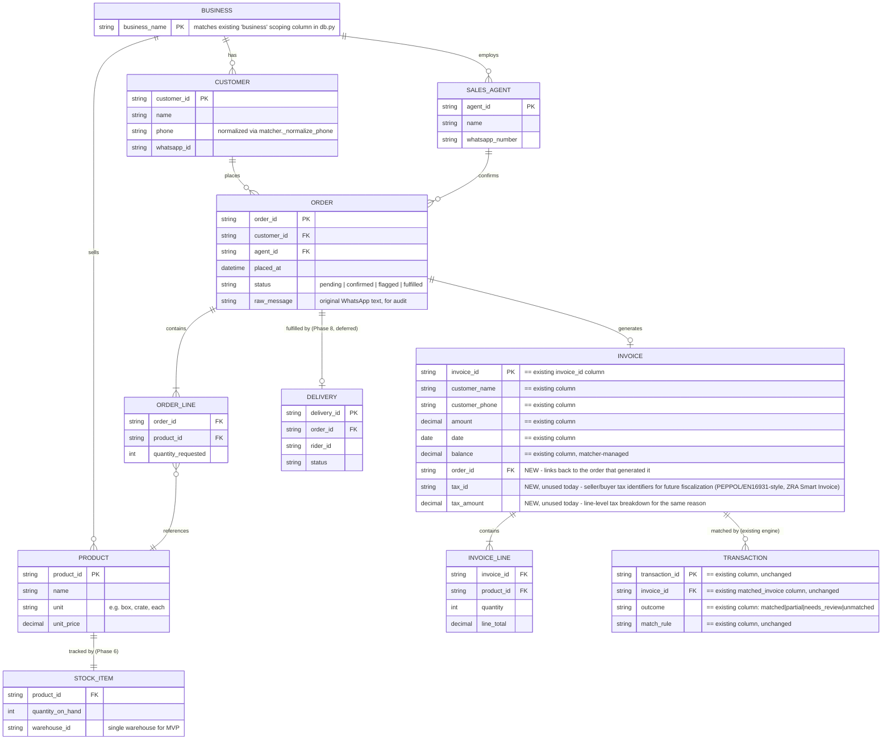

# Data Model — WhatsApp Order-to-Cash for FMCG Distributors

See [ARCHITECTURE.md](ARCHITECTURE.md) for the component picture this
data feeds. **`Invoice` and `Transaction` already exist** as the
`invoices` and `transactions` tables in `reconciler/db.py` — everything
else here is new, and is designed to produce rows in those two tables
rather than duplicate or bypass them.

## Entity-relationship diagram

## How this extends, rather than replaces, the existing schema

`reconciler/db.py`'s `SCHEMA` currently defines two tables:

- **`invoices`** (`business, invoice_id, customer_name, customer_phone, amount, date, balance`)
- **`transactions`** (`business, transaction_id, date, amount, sender_name, sender_phone, reference, matched_invoice, customer, outcome, match_rule, details, processed_at`)

Both stay exactly as they are — the matching waterfall, persistence
guarantees (re-upload doesn't undo a partial payment, overlapping
statements don't double-count), and aging logic are all unaffected. What
changes is **where invoices come from**: today a human uploads a CSV/XLSX
built outside this system; from Phase 5 onward, the Invoice Service can
also *write* a row into `invoices` directly, generated from a confirmed
`ORDER`. `load_invoices()` in `loaders.py` stays the path for a business
that still exports invoices from elsewhere (some pilots will, for a
while) — the two invoice sources coexist rather than one replacing the
other.

Two additive columns on `invoices` are anticipated but **not being added
yet**: `order_id` (links an invoice back to the order that generated it —
only meaningful once Phase 5 exists) and the tax/fiscalization fields
described in [ARCHITECTURE.md](ARCHITECTURE.md#peppol--en16931--eu-e-invoicing-standard).
Called out here so the eventual migration is a known, planned one-liner
(`ALTER TABLE invoices ADD COLUMN ...`) rather than a surprise.

## What's deliberately not modeled yet

- **Multi-warehouse stock allocation** — `STOCK_ITEM` above assumes one
  warehouse per business, matching the ICP (1–3 warehouses, and the first
  pilot need only prove the single-warehouse case).
- **Product variants/batches/expiry** — out of scope until a pilot's
  actual catalog complexity demands it.
- **Delivery routing details** (stops, sequencing, vehicle assignment) —
  `DELIVERY` is a placeholder entity for Phase 8, not a designed subsystem.
